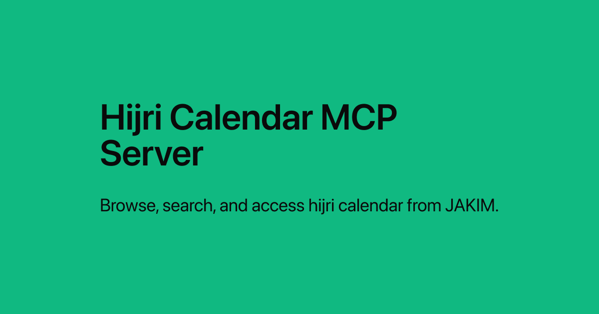

# Hijri Calendar

A remote MCP server for the Malaysian Islamic (Hijri) calendar.

It helps AI tools look up Hijri months, Gregorian dates, and important Islamic dates in Malaysia — such as Awal Ramadan, Aidilfitri, Aidiladha, Maal Hijrah, and Maulidur Rasul.

## Connect

```text
https://hijri.shahrulestar.com/mcp
```

## What it covers

- Hijri lunar months (1447H–1450H; 1450H through Sha’ban only)
- Day-by-day Hijri takwim (2025–2028 Gregorian, Asia/Kuala_Lumpur)
- Important Islamic dates and observances in Malaysia
- Matching Hijri and Gregorian (Miladi) dates

## Tools

| Tool | What it does |
|------|----------------|
| `get_lunar_months` | **Month summary.** Start, end, and length of each Hijri month. Use for “when is Ramadan?” or which month covers a Gregorian date. |
| `get_hijri_calendar` | **Day-by-day takwim.** Hijri date and weekday for one day, a Hijri month, or a short Gregorian range. |
| `get_islamic_events` | **Observances in Malaysia.** Aidilfitri, Aidiladha, Maulid, Awal Ramadan, and other important Islamic dates. |

## Data

Calendar files are split by **Gregorian year** under `data/takwim/`:

| File | Contents |
|------|----------|
| `meta.json` | Timezone, month-name dictionaries, Hijri year summaries, Islamic event templates, recurring observances |
| `2025.json`–`2028.json` | Day-by-day takwim and lunar months |

A Hijri month that spans New Year is stored in the year it **starts** (for example Sha’ban 1449H lives in `2027.json`). The MCP tools merge all years in memory, so lookups by Hijri year still work.

Calendar data follows Malaysia timezone (`Asia/Kuala_Lumpur`) and is verified against JAKIM’s official Islamic calendar (e-Solat):

[JAKIM Islamic Calendar](https://www.e-solat.gov.my/index.php?siteId=24&pageId=26)

Islamic events are stored once as Hijri month+day templates and resolved to Gregorian dates from the lunar month table. This server never advances an event earlier than its Hijri day on that table.

## Sponsor

If this calendar is useful, you can [sponsor the project on GitHub](https://github.com/sponsors/shahrulestar).

